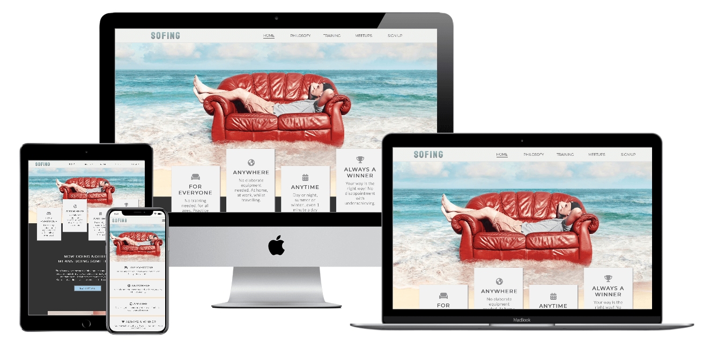

# SOFING Responsive Website

# Purpose
This project is a static website aimed at popularizing a new sporting activity called [Sofing](https://oks-erm.github.io/sofing/index.html), which involves you and your couch. It hopes to give a chance to belong to everyone who wants to be a part of a community and have a trendy hobby with little commitment. 

The core purposes of the website:
- introduce Sofing to a broad audience, spread **"philosofy"**.
- advertise related projects.
- create a community and help people connect via networking and local practices. 
- make visitors smile. 

The website is built using HTML and CSS as a Milestone Project#1 for the Code Institute's Full Stack Developer course.  

[The live website is available here](https://oks-erm.github.io/sofing/index.html)

# UX Design
## User stories
### As a **first time user**

- I want to easily understand the main purpose of the site and learn more about the topic.
- I want to be able to easily navigate and find content.
- I want to find ways to join the community and follow the movement on different social media.
- I want to be amused.

### As a **returning** and **frequent user**

- I want to find up-to-date information about events and meetings.
- I want to contact the organisation to request additional information.
- I want to join the community.
- I want to find information about training programms and self-development in the field.

### All users want to be able to access and comfortably view the website on mobile devices.

## Structure
### Home Page
- Introduces the movement and its "selling points" on the first screen.
- Provides a full overview of the topic: each page of the website is represented by it's own block.
- Catches user's attention and grips it with bold design and entertaining content.
    #### User Goal:
    >   - Understand the main purpose of the website.
    >   - Preview all the sections of the website.
    >   - Easily navigate and interact with the website.
    >   - Be amused.
    #### Website Goal:
    >   - Convey selling points and ethos.
    >   - Interest and engage the user.
    >   - Present the user a preview of all content sections.
    >   - Entertain the user.
    >   - Initiate future engagement, such as following on social media, joining the club, attending meetups etc.

### Philosofy Page
- Delivers the movement ethos and purpose in detail.
- Justifies and redeems doing nothing.
- Includes an easter egg for entertainment.
    #### User Goal:
    >   - Obtain information about the movement philosophy and ethos.
    >   - Be amused.
    #### Website Goal:
    >   - Convey the movement ethos.
    >   - Gain the users trust and sympathy.
    >   - Convince the user to join.
    >   - Entertain the user and make them smile.

### Meetups Page
- Provides up-to-date information about local meetups and practice sessions.
- Allows the user to contact local representatives.
    #### User Goal:
    >   - Find local meetups and regular practice sessions.
    >   - Check the schedule.
    >   - Be able to contact local representatives.
    #### Website Goal:
    >   - Provide information about local meetups and practice sessions.
    >   - Make it easy for the user to find one and contact local representatives.

### Signup Page
- Allows the user to join the club and get access to special programms and discounts.
    #### User Goal:
    >   - Join the club to access unique content and special offers.
    #### Website Goal:
    >   - Provide simple and accesible way to join the club.

### Meetups 
It was decided to take this section to the separate web-site (supposedly existing), because it is intended as a commercial project and contains plenty of information, which deserves a separate platform. However it was considered reasonable including it in the menu to inform about it, because the movement in new and users can not assume what features it includes. So it takes the user to the website of **Sofing Bootcamp** where the user may obtain all the relevant information about training. 

## Design

As Sofing is a completely new thing, the design shapes future brand recognition. The project's design springs from the ethos and values of Sofing: it's cheerful, bold and calm at the same time. It seems to be contrasting purposes, but it's a conscious intention to make it a little contradictory for comical effect, as a part of mocking existing cliches. It’s somewhat a combination of a stereotypical small business, sports and a furniture store website, as I see it. 

### Colour Scheme

A seemingly unconventional colour palette choice serves to embody a maverick component, mock existing cliches and challenge the rules (such as colour combination), just as Sofing does by turning doing nothing into a sport. 

Shades of Whitesmoke: #efefef, #f8f8f8 (Background colour, Text colour on dark background) - represent calm, air and light; two shades are used for volume effect.  
Dark charcoal: #333333 (Main Text Colour, Background Colour for one block on the home page) -
Charcoal Gray: #6a6a6a (Headings, when Dark Charcoal made them too heavy, and borders) -
C - cheerful, friendly and bold, 
blue - trust and .

In fact, [57% of men and 35% of women say it’s their favorite color](https://ceblog.s3.amazonaws.com/wp-content/uploads/2018/03/24214633/website-color-palettes-35.png), it’s the most common “favorite” color among the majority of the population. So, if you want to appeal to a wide audience, this could be a great choice for your site.
