# SOFING Responsive Website

# Purpose
This project is a static website aimed at popularizing a new sporting activity called [Sofing](https://oks-erm.github.io/sofing/index.html), which involves you and your couch. It hopes to give a chance to belong to everyone who wants to be a part of a community and have a trendy hobby with little commitment. 

The core purposes of the website:
- introduce Sofing to a broad audience, spread **"philosofy"**.
- advertise related projects.
- create a community and help people connect via networking and local practices. 
- make visitors smile. 

The website is built using HTML and CSS as a Milestone Project#1 for the Code Institute's Full Stack Developer course.  

[The live website is available here](https://oks-erm.github.io/sofing/index.html)
___
# UX Design
## User stories
### As a **first time user**

- I want to easily understand the main purpose of the site and learn more about the topic.
- I want to be able to easily navigate and find content.
- I want to find ways to join the community and follow the movement on different social media.
- I want to be amused.

### As a **returning** and a **frequent user**

- I want to find up-to-date information about events and meetings.
- I want to contact the organisation to request additional information.
- I want to join the community.
- I want to find information about training programs and self-development in the field.

### All users want to be able to access and comfortably view the website on mobile devices.
___
## Structure
### Home Page
- Introduces the movement and its "selling points" on the first screen.
- Provides a complete overview of the topic: each page of the website is represented by its own block.
- Grabs the user's attention and grips it with bold design and entertaining content.
    #### User Goal:
    >   - Understand the main purpose of the website.
    >   - Preview all the sections of the website.
    >   - Easily navigate and interact with the website.
    >   - Be amused.
    #### Website Goal:
    >   - Convey selling points and ethos.
    >   - Interest and engage the user.
    >   - Present the user a preview of all content sections.
    >   - Entertain the user.
    >   - Initiate future engagement, such as following on social media, joining the club, attending meetups etc.

### Philosofy Page
- Delivers the movement's ethos and purpose in detail.
- Justifies and redeems doing nothing.
- Includes an easter egg for entertainment.
    #### User Goal:
    >   - Obtain information about the movement philosophy and ethos.
    >   - Be amused.
    #### Website Goal:
    >   - Convey the movement ethos.
    >   - Gain the users trust and sympathy.
    >   - Convince the user to join.
    >   - Entertain the user and make them smile.

### Meetups Page
- Provides up-to-date information about local meetups and practice sessions.
- Allows the user to contact local representatives.
    #### User Goal:
    >   - Find local meetups and regular practice sessions.
    >   - Check the schedule.
    >   - Be able to contact local representatives.
    #### Website Goal:
    >   - Provide information about local meetups and practice sessions.
    >   - Make it easy for the user to find one and contact local representatives.

### Signup Page
- Allows the user to join the club and get access to special programs and discounts.
    #### User Goal:
    >   - Join the club to access unique content and special offers.
    #### Website Goal:
    >   - Provide a simple and accessible way to join the club.

### Meetups 
It was decided to take this section to another website (supposedly existing) because it is intended as a commercial project and contains plenty of information, which deserves a separate platform. However, it was considered reasonable to include it in the menu to inform about it because the movement is new, and users can not assume what features it includes. So it takes the user to the website of **Sofing Bootcamp**, where the user may obtain all the relevant information about training. 
___
## Wireframes

### **Home**
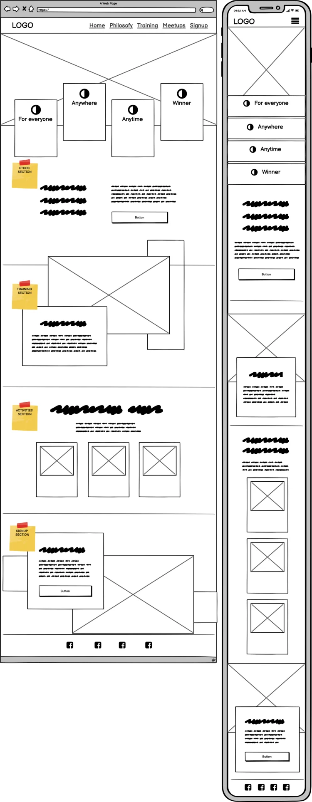

### **Philosofy**
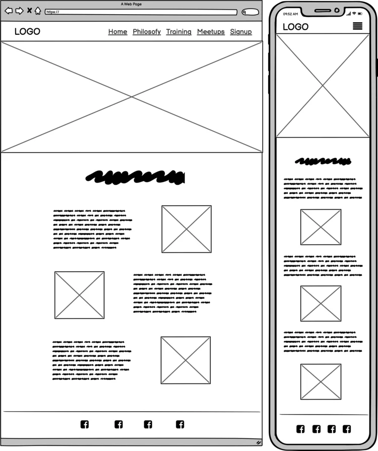

### **Meetups**
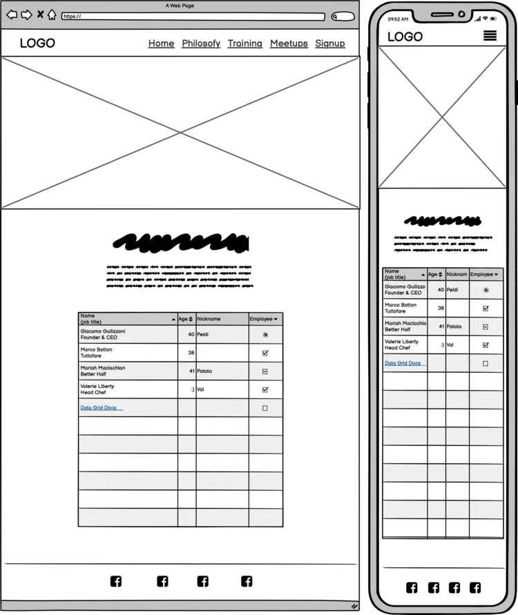

### **Signup**
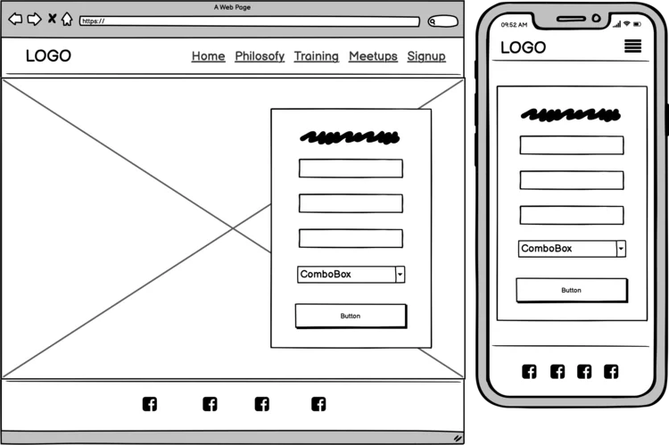

___
## Design

As Sofing is a completely new thing, the design shapes future brand recognition. The project's design springs from the ethos and values of Sofing: it is cheerful, bold and calm at the same time. It seems to be contrasting purposes, but it is a conscious intention to make it a little contradictory for comical effect as a part of mocking existing cliches. It is somewhat a combination of a stereotypical small business, gym and furniture store website as I see it. 

### Colour Scheme

A seemingly unconventional colour palette choice serves to embody a maverick component, mock existing cliches and challenge the rules (such as colour combination), just as Sofing does by turning doing nothing into a sport. 

#### **Shades of Whitesmoke** 
represent calm, air and light; two shades are used for volume effect.  
>  #efefef (Background Colour, Text Colour on dark background);

>  #f8f8f8 (Background Colour, Borders). 

#### **Shades of Charcoal Grey** 
are cool, neutral and balanced, just like Sofing wants its practitioners to be. It is also known as a sophisticated colour. It is used to bring some contrast and draw attention to the ethos block on the home page. Several shades are used to avoid excessive contrast and heavy headings but provide accessibility. 
>  #333333 (Background Colour);

>  #515151 (Default Text Colour);

>  #6a6a6a (Headings, Borders).

#### **Coral** 
represents friendliness, cheerfulness and boldness. Moreover, it seems to be one of the typical sofa colours and it refers to the [famous couch from Friends tv series](https://www.texomashomepage.com/wp-content/uploads/sites/41/2019/09/friends-orange-couch.jpg).
>  #e06666 (Background Colour).

#### **Reef**  
represents trust and tranquillity. In fact, [57% of men and 35% of women say blue is their favourite colour](https://ceblog.s3.amazonaws.com/wp-content/uploads/2018/03/24214633/website-color-palettes-35.png), it is the most common “favourite” colour among the majority of the population. So, as I want to appeal to a broad audience, I decided to implement it.
>  #a6ceef (Background Colour, Buttons, Hover effects, Gradient for Logo and Headings).

### Typography

[Koulen](https://fonts.google.com/specimen/Koulen) was intended to be used for logo and headings, however, it turned out to be too loud and intense if used for all headings, and also it compromised the legibility of many headings. Therefore, it was decided to limit its implementation and prefer softer and more neutral font for most of the headings throughout the website.

[Montserrat](https://fonts.google.com/specimen/Montserrat) was chosen for this purpose. It is neutral and easy to read. 

[Lato](https://fonts.google.com/specimen/Lato) was chosen for body text as it is light and easy to read.

### Images

The images in this project were sourced from [Unsplash](https://unsplash.com/) and [iStock](https://www.istockphoto.com). They were specifically selected to correlate with the main website colour palette and increase the aesthetic impact of the design.

### Visual Effects

#### Shadows
As the Home Page consists of multiple colourful overlapping blocks, it was important to add volume and make the content easier to perceive so the viewer's eye doesn't have to focus on understanding spatial relationships between elements, which might be daunting. However, to provide better performance on mobile devices, it was implemented only for screens larger than 992px.

#### Logo and Page Headings Gradient
Sofing movement does not have a logo at the moment. Hence, the text logo was established. Although the font provided the style, it still looked rather bland, flat and intensively dull in default text colours and illegible or inappropriate when executed in colours. Thus, it was decided to implement a gradient of [Charcoal](#shades-of-charcoal-grey) and [Reef](#reef). A similar gradient was later applied to the Philosofy Page Heading and the Meetups Page Heading, but based on [Coral](#coral), to maintain the colour palette.   

#### Blocks with CTA
Each block of the Home Page that we want users to interact with and that contains a Call To Action, such as "join the club" or "follow the link", slightly grows (3%) whilst hovered over with a mouse. It provides a stimulating visual effect and draws users' attention even if hovered over with a mouse by accident whilst scrolling. The effect was implemented only for screens larger than 992px to provide better performance on mobile devices.  

#### Buttons
Each button offers a similar growing effect described above combined with a change of its background colour: it is blue by default, and it turns subtle green hovered over with a mouse. The green colour was opted for because it is known to be the [best colour for effective CTA buttons](https://www.wordstream.com/blog/ws/2015/02/20/call-to-action-buttons). To provide better performance on mobile devices, it was implemented only for screens larger than 992px.

#### Links
Due to the bold design and abundance of content on the Home Page, it seemed to be necessary to draw additional attention to the links. When being hovered over with a mouse, links change the text colour and the background colour (depending on the parent block design), and the change is executed with an animated effect - "running" from left to right. To provide better performance on mobile devices, it was implemented only for screens larger than 992px.

#### Navbar Hover effect
The navbar includes a hover-over effect to make the experience more interactive and navigation more intuitive. When the user engages with the link or hovers over the link, its background colour changes to light blue to subtly highlight the item without compromising legibility.
___
# Features
## Existing Features
- **Navigation bar**

Each page has a full responsive sticky navigation bar at the top. It includes the Logo (which is a link to the Home page) and the links to Home, Philosofy, Training, Meetups and Signup pages. It retains an identical layout throughout the website across all devices to ensure **simple and intuitive navigation**. The Navbar will allow the user to reach any section of the website from any point on the website without unnecessary steps and using browser navigation buttons.             

For mobile devices, it transforms into a compact "hamburger menu". This dropdown menu features the same items, displayed as a column on a semitransparent background.  

- **Hero image**

This section is the first thing the user sees opening each page (apart from the Signup page, as it's organised differently due to little content), it is an eye-catching image for aesthetical stimulation, which also helps to deliver the page's semantics as visual associations are commonly very strong. On the Home page, it also includes overlayed cards with key selling points to help the user understand the purpose of the website.

On the other pages, it does not include any overlay. All images are selected to correlate with the website's colour palette and contribute to the aesthetic impact of the design, delivering semantics of the section and achieving purposes such as comical effect. Every image is followed by the section heading, executed in the colour scheme of the block representing this page on the Home page. Colour coding helps the user build associations and follow the content. 

- **Ethos section**

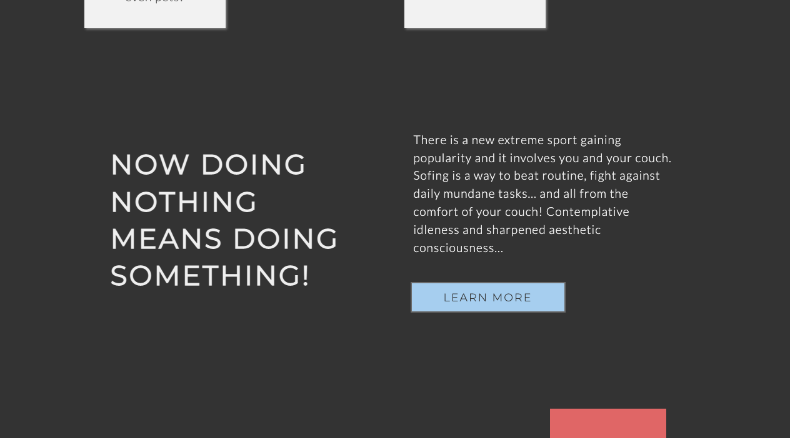

The ethos section will introduce the user to the concept of Sofing as it is something previously not known. The user will be introduced to the moto, given a little preview of philosofy statements and invited to learn more to the Philosofy page if the user finds the preview appealing.

- **Training section**

This section tells the user about the opportunities in the world of Sofing and leads to a separate website for [the reason described above](#meetups-page). Because this concept is new, the user may not assume what features it includes and does not have particular expectations. 

- **Activities section**

This section will allow the user to see the activities the movement organises. It invites the user to engage in different ways, increasing the possibility of it happening. "Sofa Shopping" invites the user to shop at our partner's website (During the testing, it demonstrated a very positive response from the users - some of them listed the Shopping website as the most memorable experience). There is also an opportunity to be paid for referral traffic. "Local Practice" leads to the Meetups page of the website, where users can obtain information about regular practice sessions in different locations. "Networking" leads to Facebook, where users could search Sofing events in their area. 

- **Signup section**

This section will explain the benefits of club membership and, combined with the experience of the journey through the Home page, will motivate the user to join. It contains interactive elements and a CTA button to stimulate the user to join.

- **Footer**

The Footer contains the links to the social media and allows the user to continue engagement with the movement on various platforms. 

- **Philosofy page**

This page contains detailed information about the movement philosophy (the different spelling is used as a joke to improve branding) to convince the user to get involved. A CTA button at the bottom was considered, but then it was decided to remove it because the project is non-commercial and intrusive CTA buttons do not correlate with the spirit of the Philosofy page.

- **Meetups page**

This page will allow users to find up-to-date information about practice sessions in different locations. It includes the schedule, the location (leads to a page of the venue on Google Maps) and a clickable phone number, so you can call right away from the page without copying and pasting the number.

- **Signup page**

This page will allow the user to sign up to Sofing and become a part of the community. The page contains the form, where the user will be asked to submit their full name and email address and choose the country to provide the user with more relevant information about the movement's activities and events.

- **Easter egg**

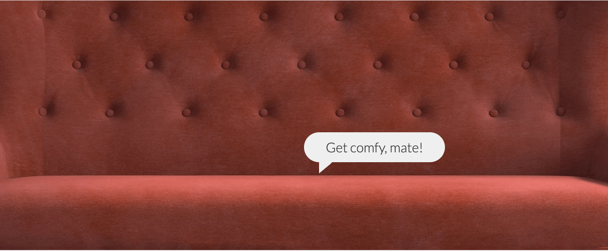

The Philosofy page includes an easter egg. It appears when hovered over with a mouse over the hero image somewhat below the "Philosofy" link in the Navbar, so the user might come across it whilst scrolling. Implemented for screens above 1200px.

## Responsive layout

The site is designed to be flexible, fluid, responsive and aesthetically enjoyable on all screen sizes and resolutions starting from 350px (based on [statistics for 2022](https://worship.agency/wp-content/uploads/2022/01/mobile-screen-sizes-2022.png)). To ensure better performance on mobile devices, mobile versions (smaller in size with different aspect ratios) of all hero images are provided. It was considered necessary because the images play a significant role in delivering the semantics of the website and providing the intended user experience. However, it was decided to omit the image for the Signup page for the mobile version, as the Signup form takes up all the screen space on mobile devices. 

The choice of breakpoints was based on different aspects, such as typical devices' screen sizes and the intention to provide the best possible presentation of the content for all screen sizes. 768px breakpoint is meant to hit the iPad mini; 992px is quite common to signify the transition to laptops, and, content-wise, it proved to be reasonable. 1200px is not a typical choice, but it was preferred based on the content layout. Media query for screens above 1200px also contains fixed width for many blocks, as, for the convenience of the user and maintaining design aesthetics, it was decided to stop the content from further expanding. 

Flexbox and Grid, depending on the content of the block, were used to allow the website to expand and shrink responsively to a device screen size providing each page's design integrity. Elements must maintain their respective position (or change if intended for more efficient representation), they do not overlap or misalign, and the content does not overflow. 

## Feature Considerations

### Signup form processing

Currently, on submission of the Sign-Up form, the data goes to the form dump, so the input is not being processed or stored. With the knowledge of SQL and Python, the input could be stored, processed, analysed and used to provide the user with a personalised quality experience.

### Popup preview of Google Maps

Currently, on the Meetups page, the location link leads the user to Google Maps. By including JS we could provide the user with the necessary information in a popup window without leaving the website.

### Gallery aggregated from social media by hashtag

Currently, the website does not have any gallery. The heart of Sofing is people, so having a gallery block on the Home page aggregated from social media might be a glorious live representation of the movement. 

___

# Technologies
- HTML to accomplish the structure of the website.
- CSS to style the website.
- [Gitpod](https://gitpod.io/) IDE to develop the website.
- [GitHub](https://GitHub.com/) to host the source code and GitHub Pages to deploy and host the live site.
- Git to provide version control (to commit and push code to the repository). 
- [FontAwesome](https://fontawesome.com/) v5.15.1 Icons.
- [Google Fonts](https://fonts.google.com/) for typography.
- [Google Chrome Dev Tools](https://developers.google.com/web/tools/chrome-devtools) for debugging, inspecting pages' elements and testing layout.
- [CloudConvert](https://cloudconvert.com/webp-converter) to optimise images to reduce storage and enhance the website performance.
- [TinyJPG](https://tinyjpg.com/) to optimise images for readme. 
- [Favicon.cc](https://www.favicon.cc/) to create the website favicon.
- [Coolors](https://coolors.co/image-picker) to source colour palette from image.
- [Balsamiq](https://balsamiq.com/wireframes/) to design wireframes.
- [Techsini](https://tecnisih.com) to create the Mockup image in this README.
- Google Chrome's [Lighthouse](https://developers.google.com/web/tools/lighthouse) to assess accessibility.
- [Screen Reader for Google Chrome](https://chrome.google.com/webstore/detail/screen-reader-for-google/nddfhonnmhcldcbmhbdldfpkbfpgjoeh/related?hl=en) to assess screen-reader accessibility.
- Toptal [Colorfilter](https://www.toptal.com/designers/colorfilter/) to assess colour-blind accessibility.
- [W3C HTML Markup Validator](https://validator.w3.org/) to validate HTML code.
- [W3C Jigsaw CSS Validator](https://jigsaw.w3.org/css-validator/) to validate CSS code.
- [Markdown Tables Generator](https://www.tablesgenerator.com/) to generate tables for the readme file.
- Code Institute's Gitpod Template to generate the workspace for the project.
___
# Testing

## User Story Testing
| Expectations                                                                                 | Realisation                                                                                                                                                                                                                                                                                                                                                                                                                          |
|----------------------------------------------------------------------------------------------|--------------------------------------------------------------------------------------------------------------------------------------------------------------------------------------------------------------------------------------------------------------------------------------------------------------------------------------------------------------------------------------------------------------------------------------|
| **As a first time user:**                                                                    |                                                                                                                                                                                                                                                                                                                                                                                                                                      |
| I want to easily understand the main purpose  of the site and learn more about the topic. | 1. On the Home Page, the user is presented with a logo,  a meaningful hero image, conveying the ethos, and selling  points, with relevant icons, on the first screen.  2. The Home page provides a complete overview of the topic:   each page of the website is represented by its own block and  ethos block appears on the second screen and includes a CTA  button, that invites the user to learn more.  |
| I want to be able to easily navigate  and find content.                                   | 1. The sticky Navbar allows the user to easily navigate and reach any point of the website from any other point.  2. All external links open in a new tab.                                                                                                                                                                                                                                                                  |
| I want to find ways to join the community  and follow the movement on social media.       | 1. The Signup section of the Home page and the Signup page allow the user to join the club.  2. The Footer contains the links to the social media and  allows the user to continue engagement with the movement  on various platforms.                                                                                                                                                                                |
| I want to be amused.                                                                         | 1. The imagery helps to achieve a comical effect from first sight.  2. The text content is absurd and unexpected.  3. The website has "an easter egg" to make the user smile and surprise them.                                                                                                                                                                                                                    |
| **As a returning and frequent user:**                                                        |                                                                                                                                                                                                                                                                                                                                                                                                                                      |
| I want to find up-to-date information  about events and meetings.                         | 1. The Meetups page provides up-to-date information about  local meetups and practice sessions and allows the user to  contact local representatives via phone call.                                                                                                                                                                                                                                                           |
| I want to contact the movement  to request additional information.                    | 1. The Footer contains the links to the social media to contact the movement there.  2. The Meetups page includes phone numbers of local   representatives.                                                                                                                                                                                                                                                       |
| I want to join the community.                                                                | 1. The Signup section of the Home page and the Signup page allow the user to join the club.  2. The Activities section on the Home page includes information about available activities and links to continue engagement on different platforms.                                                                                                                                                                      |
| I want to find information about training  programs and self-development in the field.    | 1. The Training section of the Home page and the Training link  of the Navbar inform about the availability of training programs and lead to the Bootcamp Website.                                                                                                                                                                                                                                                                 |
| **All users:**                                                                               |                                                                                                                                                                                                                                                                                                                                                                                                                                      |
| want to be able to access and comfortably  view the website on mobile devices.            | 1. The website is fully responsive on all screen sizes and  resolutions starting from 350px.  2. Mobile performance is considered by providing lighter images for the mobile version.  3. The website is designed following the mobile-first approach to ensure that mobile users receive quality, not reduced experience.                                                                                |

## Feature Testing

All Features were tested manually, find the results below.
The website was tested in three browsers: Chrome, Firefox and Safari on Desktops, tablets and multiple mobile devices (macOS and Android).

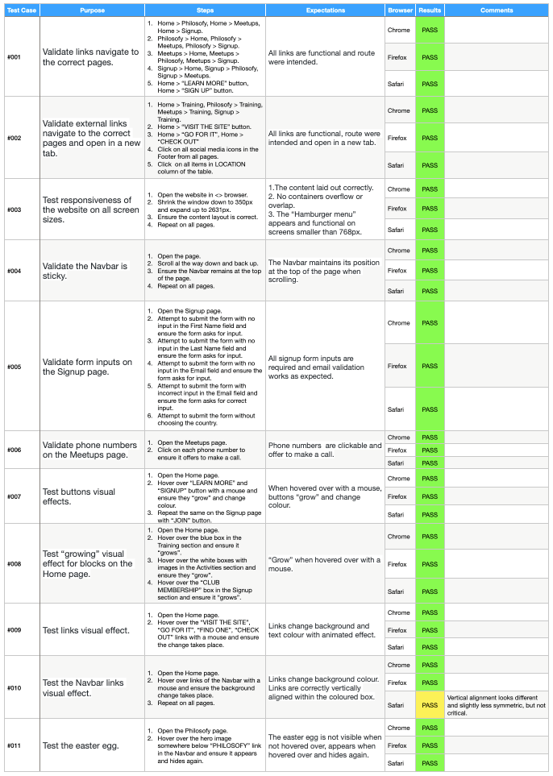

Testing results: [Excel](assets/testing_doc/features_testing.xlsx), [Numbers MacOS](assets/testing_doc/feature_testing.numbers).

## Automated Testing

1. **[W3 Markup Validation](https://validator.w3.org/) - HTML Validation**

All pages were run through HTML Validator. No errors were detected.

2. **[W3 Jigsaw](https://jigsaw.w3.org/css-validator/) - CSS Validation**

CSS Stylesheet was run through CSS Validator. No errors were detected.

3. **[Google Lighthouse](https://developers.google.com/web/tools/lighthouse)**

**Home Page**

Mobile

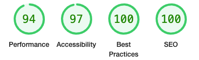

Desktop

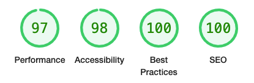

**Philosofy Page**

Mobile

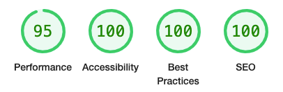

Desktop

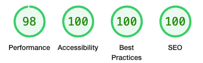

**Meetups Page**

Mobile

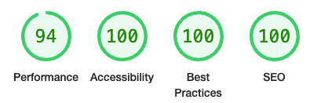

Desktop

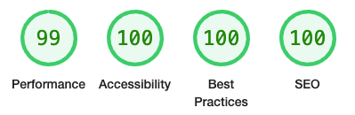

**Signup Page**

Mobile

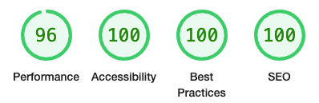

Desktop

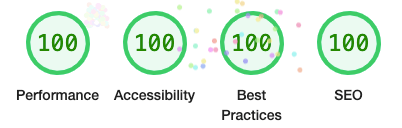

## Accessibility Testing

### Screen Reader for Goggle Chrome

The website was tested with [Screen Reader for Goggle Chrome](https://chrome.google.com/webstore/detail/screen-reader/kgejglhpjiefppelpmljglcjbhoiplfn?hl=en). No issues arose. 

### Toptal Colorfilter

The website was tested with Toptal [Colorfilter](https://www.toptal.com/designers/colorfilter/) to make sure it is accessible for colour-blind users. No accessibility issues were detected.

[Result preview 1](https://www.toptal.com/designers/colorfilter?orig_uri=https://oks-erm.github.io/sofing/index.html&process_type=protan)

[Result preview 2](https://www.toptal.com/designers/colorfilter?orig_uri=https://oks-erm.github.io/sofing/index.html&process_type=deutan)

[Result preview 3](https://www.toptal.com/designers/colorfilter?orig_uri=https://oks-erm.github.io/sofing/index.html&process_type=tritan)

[Result preview 4](https://www.toptal.com/designers/colorfilter?orig_uri=https://oks-erm.github.io/sofing/index.html&process_type=grey)

However, a layout bug was found, which did not appear at any other stage.

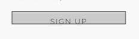

## Detected Issues and Resolutions

A bug with the "SIGN UP" button on the Home page was detected during the testing with Toptal [Colorfilter](https://www.toptal.com/designers/colorfilter/). However, it did not appear on any device, browser or screen size during other testing stages. I struggled to "achieve" the same result to be able to resolve it when finally it was detected again on the mobile device with activated accessibility tools. Interestingly, my phone with accessibility tools on did not produce the bug.  

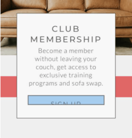

The reason for this bug was a padding conflict. It was fixed by reconsidering paddings and margins in the block. I tested it via Toptal Colorfilter because I was not able to access this bug any other way. 
___

# Deployment

This project was deployed to GitHub pages. The steps to deploy are as follows:

1. Log into GitHub.
2. Select `sofing` from the list of repositories.
3. Select `Settings` From the Repositories sub-headings.
4. In the left side menu select `Pages` from `Code and automation` section.
5. Under the `Source` heading in the dropdown menu select `main`.
6. A second drop-down menu should remain with the default value `/(root)`.
7. Press `Save`.
8. A message that the website is ready to be deployed will appear, refresh the page and the link to the deployed site will be available in a green sub-section on the top of the page.
9. Click on the link to go to the live deployed page.

The live link can be found [here](https://oks-erm.github.io/sofing).

## How to run this project Locally

- **Clone the repository**
1. Navigate to the GitHub Repository `oks-erm/sofing`.
2. Click the `Code` drop-down menu.
3. Click the `HTTPS` sub-heading under the `Clone` heading.
4. Copy the link.
5. Open an IDE of your choice (VSCode, Atom, Komodo, etc).
6. Open a terminal in the directory of your choice, type `git clone` and paste the link.
7. A clone of the repository will now be created on your machine.

- **Download the repository manually**
1. Navigate to the GitHub Repository `oks-erm/sofing`.
2. Click the `Code` drop-down menu.
3. Click `Download ZIP`.
4. Locate the ZIP file and extract it to a folder where you want the repository to be stored. 
5. Open an IDE of your choice (VSCode, Atom, Komodo, etc).
6. Navigate to the directory where the repository was extracted.
7. Now you will have the contents of the project available offline on your machine.
___

# Credits

## Content

The concept and the text used on the website are produced by me. Little fragments of the text could be found [here](https://www.trendhunter.com/trends/a-new-extreme-sport-sofing), as they were earlier published by my friend Hernando Gomez Salinas. He tried to start it off as a meme, but it took root only in the Spanish speaking community and not for long. I would like to give it a second chance.

## Media

- hero-image.webp is by @littlehenrabi from [iStock](https://istockphoto.com).
- training.webp is by @inside-weather from [Unsplash](https://unsplash.com).
- act1.webp is by Carlos Muchado from [Unsplash](https://unsplash.com).
- act2.webp is by Franck Boston from [iStock](https://istockphoto.com).
- act3.webp is by @4x6 from [iStock](https://istockphoto.com).
- signup-section.webp is by Paul Weaver from [Unsplash](https://unsplash.com).
- signup.webp is by Alexis Antoine from [Unsplash](https://unsplash.com).
- meetups.webp is by Ben Lambert from [Unsplash](https://unsplash.com).
- philosofy.webp is by Guven Gunes from [Unsplash](https://unsplash.com).
- philosofy1.webp is by Logan Cameron from [Unsplash](https://unsplash.com).
- philosofy2.webp is by Juan Gomez from [Unsplash](https://unsplash.com).
- philosofy3.webp is by Alina Levkovich from [Unsplash](https://unsplash.com).
- favicon.ico was created by me. 

## Code

- Implementation of Flexbox and Grid was assisted by [CSS Tricks](https://css-tricks.com).
- Code snippets for iplementation of "hamburger menu" were taken from [here](https://alvarotrigo.com/blog/hamburger-menu-css-responsive/) and [here](https://codepen.io/erikterwan/pen/EVzeRP) and modified.
- Code snippet for the links hover effect is taken from [CSS Tricks](https://css-tricks.com/css-link-hover-effects/) and modified.
- Code snippet for the "Choose your country" field is taken from [here](https://www.technicalkeeda.com/html-tutorials/all-countries-drop-down-list-in-html).
- Code snippet for the speech bubble was taken from [here](https://freefrontend.com/css-speech-bubbles/) and modified.
- Code snippet for the gradient effect for text was taken from [CSS Tricks](https://css-tricks.com/snippets/css/gradient-text/) and modified.
- Guidance on HTML attributes and common conventions were obtained from [W3Schools](https://www.w3schools.com/) and [Mozilla's Web Documentation](https://developer.mozilla.org/en-US/).
- Understanding of shadows was obtained from [W3Schools](https://www.w3schools.com/).

## Acknowledgements

I would like to thank my mentor, Ronan McClelland, for his guidance, moral support, inspiration, invaluable advice and sense of humour.

Thanks to Slack Community for answering all my questions before I asked them.
___

